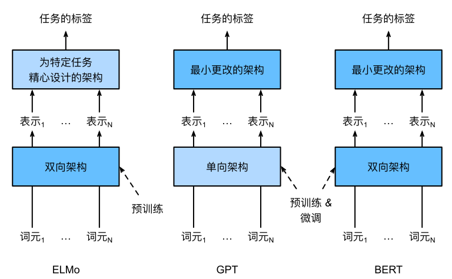
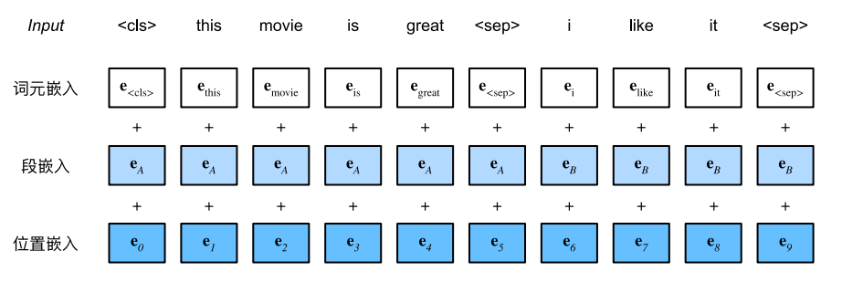
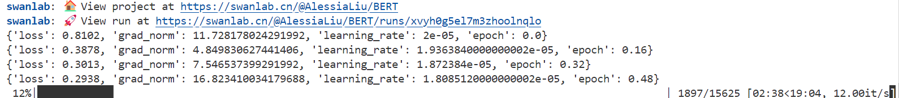
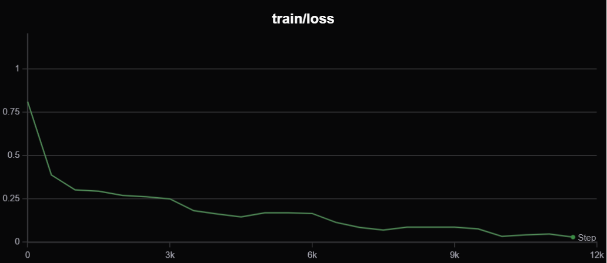
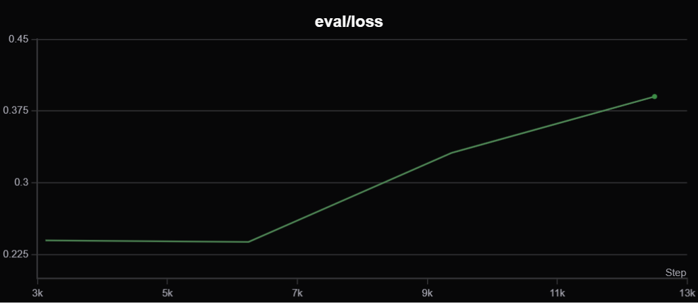
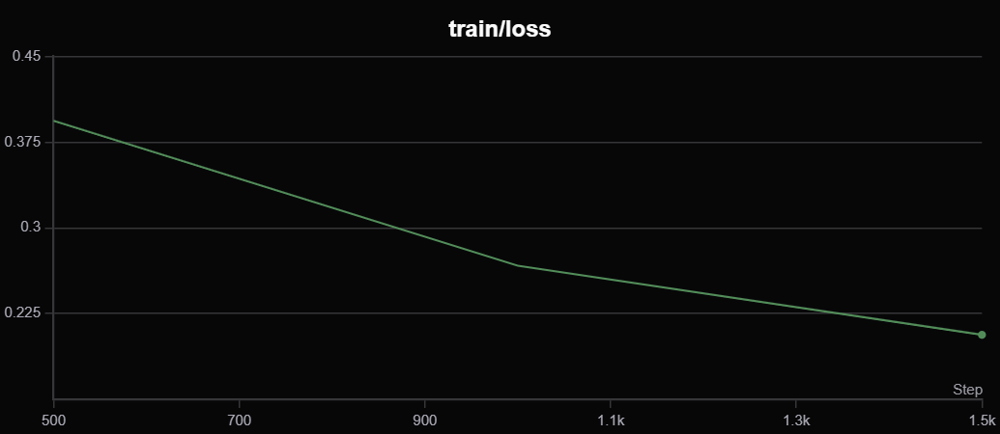
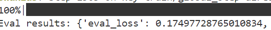
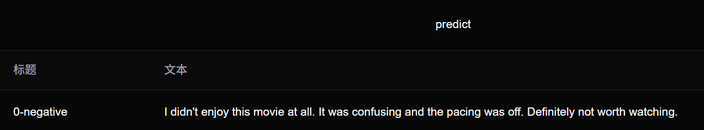

# BERT-IMDB电影评论情感分类

SC24219058 刘天润

### 环境配置

使用datasets、transformers、SwanLab三个开源工具，实现数据集准备、代码编写、可视化训练。

安装以下Python库：

```
transformers>=4.41.0
datasets>=2.19.1
swanlab>=0.3.3
```
安装命令：
```
pip install transformers datasets swanlab
```

## BERT模型

### 模型选择
__ELMo__ 对上下文进行双向编码，但使用特定于任务的架构；而 __GPT__ 是任务无关的，但是从左到右编码上下文。__BERT__（来自Transformers的双向编码器表示）结合了这两个方面的优点。它对上下文进行双向编码，并且对于大多数的自然语言处理任务 (Devlin et al., 2018)只需要最少的架构改变。通过使用预训练的Transformer编码器，BERT能够基于其双向上下文表示任何词元。在下游任务的监督学习过程中，BERT在两个方面与GPT相似。首先，BERT表示将被输入到一个添加的输出层中，根据任务的性质对模型架构进行最
小的更改，例如预测每个词元与预测整个序列。其次，对预训练Transformer编码器的所有参数进行微调，而
额外的输出层将从头开始训练。

下图描述了ELMo、GPT和BERT之间的差异：
<p  align="center">

</p>

### 输入表示
情感分析以单个文本作为输入,BERT输入序列是
特殊类别词元“<cls>”、文本序列的标记、以及特殊分隔词元“<sep>”的连结。

BERT选择Transformer编码器作为其双向架构。Transformer编码器的常见架构是位置嵌入被加入到输入序
列的每个位置，BERT与原始的Transformer编码器不同，使用可学习的位置嵌入。

下图表明BERT输入序列的嵌入是词元嵌入、片段嵌入和位置嵌入的和。



### 预训练模型
BERT是以自监督的方式在大量英语数据语料库上进行预训练的transformer模型。它只在原始文本上进行了预训练，没有人工标记。

预训练包括以下两个任务：

1)掩码语言建模（MLM）：以一个句子为例，该模型随机掩码输入中15%的单词，然后通过模型运行整个掩码句子，并必须预测掩码单词。

2)下一个句子预测（NSP）：模型在预训练期间将两个掩码句子连接起来作为输入。有时它们对应的是原文中相邻的句子，有时不是。然后，该模型必须预测两个句子是否相邻。

使用` bert-base-uncased`模型，它有12层，768个隐藏单元和12个注意力头，并在分词之前将所有文本转换为小写。
预训练好的BERT模型都包含一个定义词表的“vocab.json”文件和一个预训练参数的“pretrained.params”文件。

## 准备数据集
### 读取数据
预先从facehug.io下载数据集
```python
dataset = load_dataset('./imdb')
```

IMDB数据集有50k条电影评论，每条评论有二元情感分类的标签。

### 预处理
使用tokenizer来编码评论数据:
```python
# 加载预训练的BERT tokenizer
tokenizer = AutoTokenizer.from_pretrained('./bert-base-uncased')

# 定义tokenize函数
def tokenize(batch):
    return tokenizer(batch['text'], padding=True, truncation=True)

# 对数据集进行tokenization
tokenized_datasets = dataset.map(tokenize, batched=True)
```
这将tokenizer应用于` text `列并返回输入id（数字标记表示）、注意力掩码（区分填充和实际标记）和标记类型id（用于区分不同的序列）。


## 模型训练

### 加载预训练的BERT模型
```python
model = AutoModelForSequenceClassification.from_pretrained('./bert-base-uncased', num_labels=2)
```

### 训练设置
从transformer工具加载Trainer API使训练更容易
```python
from transformers import Trainer
```

设置训练参数
```python
training_args = TrainingArguments(
    output_dir='./results',
    eval_strategy='epoch',
    save_strategy='epoch',
    learning_rate=2e-5,
    per_device_train_batch_size=8,
    per_device_eval_batch_size=8,
    logging_first_step=100,
    # 总的训练轮数
    num_train_epochs=2,
    weight_decay=0.01,
    report_to="none",
    # 启用多GPU训练
    dataloader_num_workers=4 if num_gpus > 1 else 0,
    fp16=torch.cuda.is_available(),  # 如果GPU支持混合精度训练，则启用
)
```
定义trainer
```python
trainer = Trainer(
    model=model,
    args=training_args,
    train_dataset=tokenized_datasets['train'],
    eval_dataset=tokenized_datasets['test'],
    callbacks=[swanlab_callback],
)
```

### 训练分析


训练轮数设为5个epoch，观察train和test loss的变化





可以看到在第3个epoch时test loss已经上升，说明应在第3个epoch之前终止训练。

## 结果分析

### 训练结果
在train loss下降到0.2左右停止



### 验证集结果
此时验证集上的loss为0.175，比较低。



### 模型推理



随便输入电影评价的英文文本，情感推理正确。