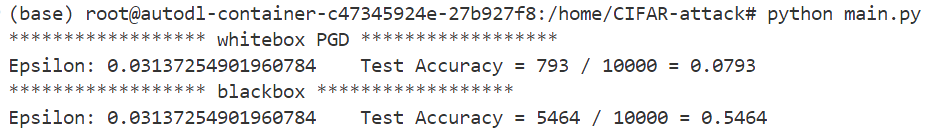

# 对抗攻击
刘天润 SC24219058

- 攻击目标：CIFAR-10预训练的ResNet-20模型

- 攻击模式：白盒和黑盒攻击
## 数据和模型准备
### 导入模块
```python
import torch
import torch.nn.functional as F
import torch.optim as optim
import torchvision.transforms as transforms

from torchvision.datasets import CIFAR10
from torch.utils.data import DataLoader
from pytorchcv.model_provider import get_model as ptcv_get_model

```
除了神经网络要用的基本模块torch.nn, torch.optim外，还用到了pytorchcv库，其中的model_provider模块提供了加载模型的函数get_model，可以加载用CIFAR-10预训练的模型。

### 加载预训练模型

```python
# Load pre-trained ResNet-20 model
model = ptcv_get_model("resnet20_cifar10", pretrained=True)
model = model.to(device)  # Move model to the device
model.eval()
```

### 加载测试数据
```python
# Load CIFAR-10 test dataset
test_dataset = CIFAR10(root='./data', train=False, download=False, transform=transform)
test_loader = DataLoader(test_dataset, batch_size=64, shuffle=False)

```

## 攻击实现
### 白盒攻击
定义pgd攻击函数
```python
def pgd_attack(model, images, labels, eps, alpha, iters) :
    images = images.to(device)
    labels = labels.to(device)
    loss = nn.CrossEntropyLoss()
    # 原图像
    ori_images = images.data

    for i in range(iters) :
        images.requires_grad = True
        outputs = model(images)

        model.zero_grad()
        cost = loss(outputs, labels).to(device)
        cost.backward()
        # 图像 + 梯度得到对抗样本
        adv_images = images + alpha*images.grad.sign()
        # 限制扰动范围
        eta = torch.clamp(adv_images - ori_images, min=-eps, max=eps)
        # 进行下一轮对抗样本的生成。破坏之前的计算图
        images = torch.clamp(ori_images + eta, min=0, max=1).detach_()

    return images
```
测试函数
```python
def test_pgd(model, device, test_loader, epsilon, alpha, num_iterations):
    correct = 0
    for data, target in test_loader:
        data, target = data.to(device), target.to(device) 
        # 使用PGD算法生成对抗样本
        perturbed_data = pgd_attack(model, data, target, epsilon, alpha, num_iterations)
        # 用目标模型对对抗样本进行分类
        output = model(perturbed_data)
        final_pred = output.max(1, keepdim=True)[1]
        correct += final_pred.eq(target.view_as(final_pred)).sum().item()

    final_acc = correct / len(test_loader.dataset)
    print("****************** whitebox PGD ******************")
    print(f"Epsilon: {epsilon}\tTest Accuracy = {correct} / {len(test_loader.dataset)} = {final_acc}")
    return final_acc
```

### 黑盒攻击
选择vgg16作为替代模型，利用对抗样本的迁移性，用PGD算法根据替代模型生成对抗样本。

加载和修改VGG模型

```python
# 修改 VGG 模型使之适应32x32大小图像
class ModifiedVGG(nn.Module):
    def __init__(self, original_model):
        super(ModifiedVGG, self).__init__()
        self.features = original_model.features
        self.fc1 = nn.Linear(512, 4096)
        self.fc2 = nn.Linear(4096, 4096)
        self.fc3 = nn.Linear(4096, 10)  #输出层，CIFAR-10有10个类别
    def forward(self, x):
        x = self.features(x)
        x = x.view(x.size(0), -1)  #展平特征图
        x = F.relu(self.fc1(x))
        x = F.dropout(x, p=0.5, training=self.training)
        x = F.relu(self.fc2(x))
        x = F.dropout(x, p=0.5, training=self.training)
        x = self.fc3(x)
        return x

#加载预训练的VGG模型(作为替代模型
original_vgg = ptcv_get_model("vgg16", pretrained=True)
surrogate_model = ModifiedVGG(original_vgg) # 创建修改后的VGG模型
surrogate_model = surrogate_model.to(device) 
surrogate_model.eval()
```
黑盒攻击函数
```python
def black_box_attack(model, surrogate_model, device, test_loader, epsilon, alpha, num_iterations):
    correct = 0
    for data, target in test_loader:
        data, target = data.to(device), target.to(device)
        #使用替代模型生成对抗样本
        perturbed_data = pgd_attack(surrogate_model, data, target, epsilon, alpha, num_iterations)
        # 用目标模型对对抗样本进行分类
        output = model(perturbed_data)
        final_pred = output.max(1, keepdim=True)[1]
        correct += final_pred.eq(target.view_as(final_pred)).sum().item()

    final_acc = correct / len(test_loader.dataset)
    print("****************** blackbox ******************")
    print(f"Epsilon: {epsilon}\tTest Accuracy = {correct} / {len(test_loader.dataset)} = {final_acc}")
    return final_acc
```
## 结果及分析
参数设置：
```python
epsilon = 8 / 255
alpha = 2 / 255
num_iterations = 40
```
运行结果



由上图，白盒攻击精度为7.93%，满足精度<10%的要求；黑盒攻击精度为54.64%。